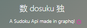
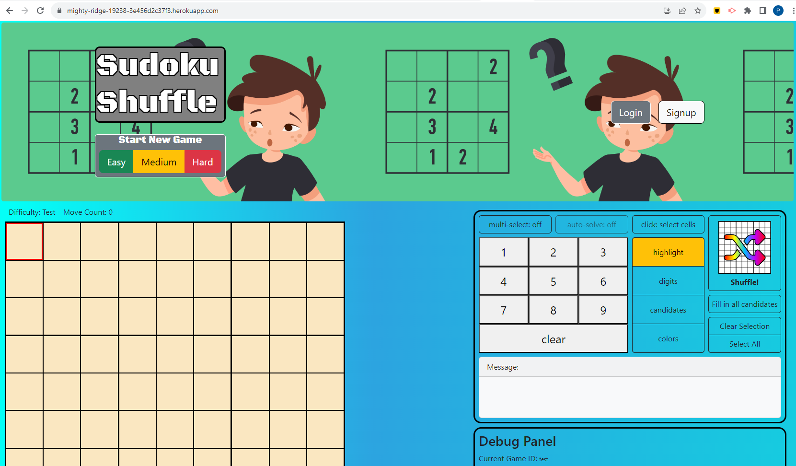
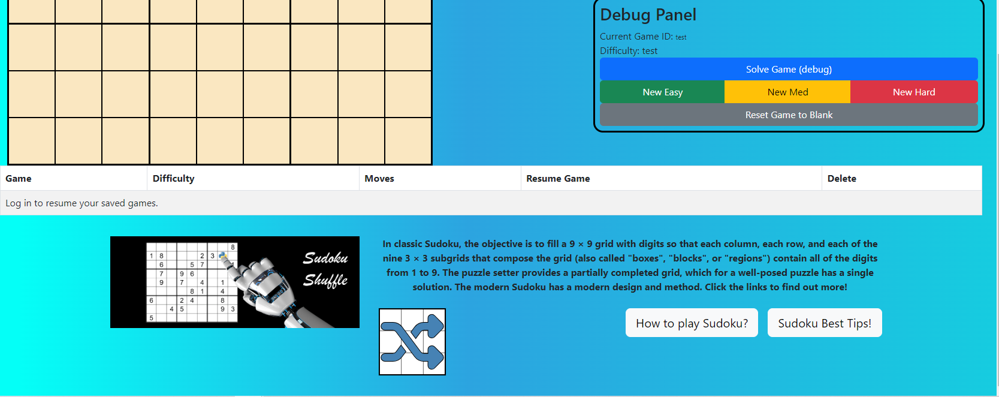
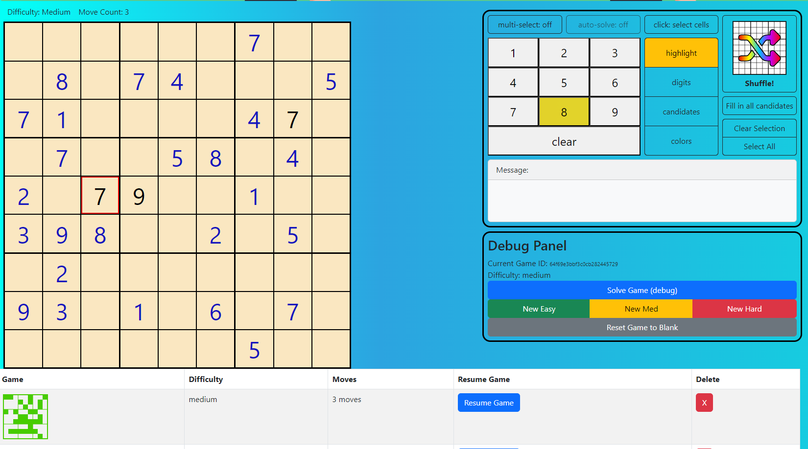
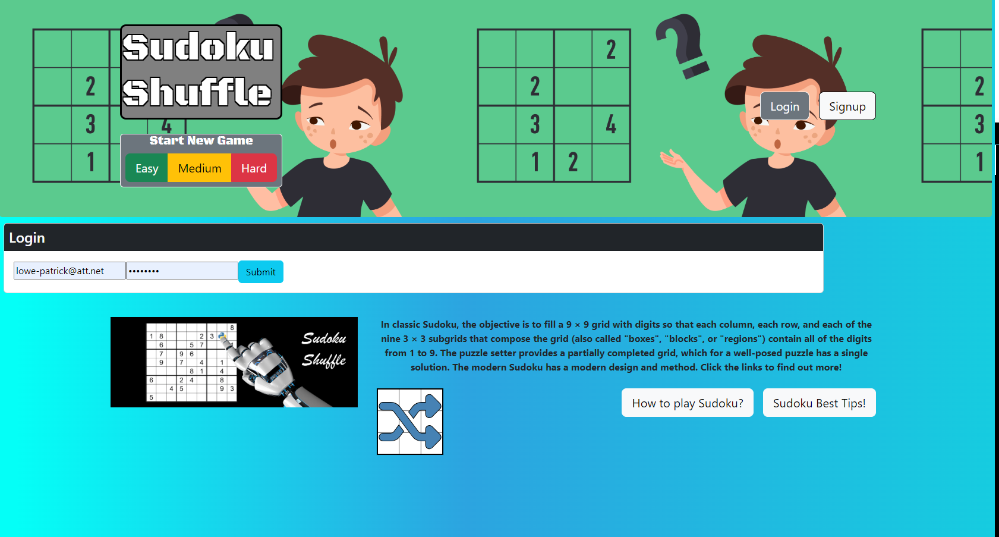
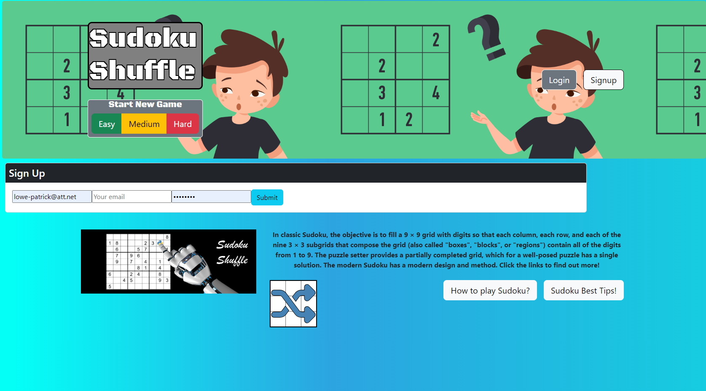
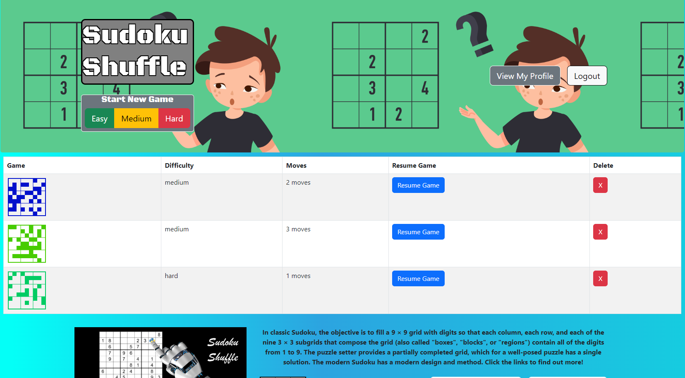

# 

# Sudoku-Shuffle

## Developers

#### [Ben Storlie](https://github.com/benjstorlie)

#### [Patrick Lowe](https://github.com/PatrickWLowe)

#### [Karelyn Rojas](https://github.com/i-kare)

#### [Nicolas Coiner](https://github.com/npcoiner)

#### [Gabreila Avelas](https://github.com/GabySSK)

## Table of Contents

- [Description](#description)
- [Technologies Used](#technologies-used)
- [Installation](#installation)
- [Deployed Website Screenshots](#deployed-website-screenshots)
- [Link to Deployed Website](#link-to-deployed-website)
- [Notes And Future Development](#notes-and-future-development)
- [License](#license)
- [References](#references)

## Description

We made a website called [Sudoku Shuffle](https://mighty-ridge-19238-3e456d2c37f3.herokuapp.com/) that allows you to play games of Sudoku and save your progress. Simply navigate to [Sudoku Shuffle](https://mighty-ridge-19238-3e456d2c37f3.herokuapp.com/signup)'s Signup Page and enter a valid username, email and password to create an account. Once you are logged in, you are ready to start saving in-progess games to your profile.

## Technologies Used

### bcrypt

## Installation

You will need to clone this repo locally. You will also need to download MongoDB Compass. Open the folder and in the parent directory from your terminal run the command "npm install". Once the installtion is complete, use the command "npm run develop" in your terminal and the website should be built and deployed to you localhost:3000.

## Deployed-Website-Screenshots

### Homepage

### Bottom of Homepage

### Logged in Homepage

### Login Page

### Signup Page

### Profile Page

## Link to Deployed Website

* Access the app at [mighty-ridge-19238-3e456d2c37f3.herokuapp.com](https://mighty-ridge-19238-3e456d2c37f3.herokuapp.com/)

## Notes and Future Development

1. As we are still in development, please use the Debug Panel on the side to simulate solving, or generate a game without waiting for the [Dusoku API](https://sudoku-api.vercel.app/).

2. [Please see the issues page](https://github.com/benjstorlie/sudoku-shuffle/issues) for our plans for future development!

    * There are several functionalities that we have some starter code ideas for.  It is a more involved process to integrate saving the game at the desired times.

3. Getting a stopwatch fully functional would be great. Considering pausing, restarting, and saving, means there's a lot of room for bugs.

## License

### This project is licensed under the MIT License

[MIT](https://opensource.org/licenses/MIT)

## References

1. [Dusoku API](https://sudoku-api.vercel.app/) for grid generation
2. [Sudoku Game in React by raravi](https://github.com/raravi/sudoku) was a great reference as it is meant to be "a fun way to learn React for those who are still in the beginning stages!"
3. [Sudoku Slam](https://www.sudokuslam.com/) is a great inspiration for game functionality.
4. [Cracking the Cryptic / Sudoku Pad](https://app.crackingthecryptic.com/) is also a great inspiration for game functionality
5. [A branch from this app is on github pages.](https://benjstorlie.github.io/sudoku-shuffle/) This is as far as Ben had gotten just using JavaScript and HTML. It shows much of the main functionality, including selecting cells, arrow keys, number keys, highlighting, auto-solving, coloring. So it was a good jumping off point to create a React app to handle state management.
